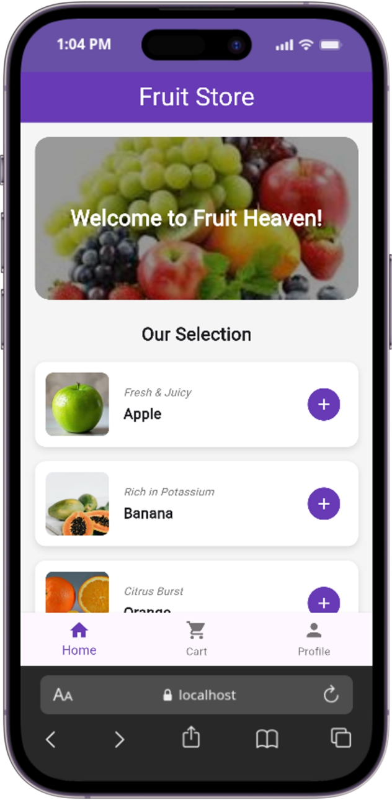
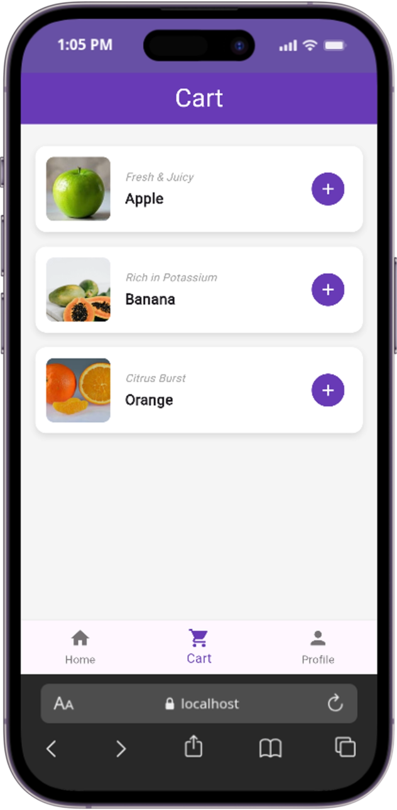
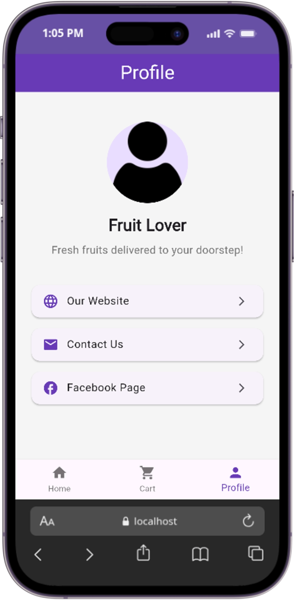

# Widget Presentation - BottomNavigationBar Demo

A simple Flutter fruit store app that demonstrates the `BottomNavigationBar` widget in a realistic shopping scenario.

`BottomNavigationBar` lets users switch between the home, cart, and profile screens with a single tap.

## Run instructions

1. Ensure you have Flutter installed.
2. Clone the repository:
   ```bash
   git clone https://github.com/albertniyo/widgetpresent.git
   cd widgetpresent
   ```
3. Fetch dependencies:
   ```bash
   flutter pub get
   ```
4. Run the app:
   ```bash
   flutter run
   ```
   Here you can use an emulator, a physical device or mobile simulator extension on your browser.

## Three demonstrated properties of `BottomNavigationBar`

| Property | Default value | Live change | Visual effect | Why a developer would adjust it |
|----------|---------------|-------------|---------------|--------------------------------|
| **`currentIndex`** | `0` | the demo uses state to change it when the user taps any item. | the selected icon and label become highlighted (color changes according to `selectedItemColor`). | to keep the UI in sync with the currently displayed screen. Without it, tapping a tab wouldn’t update the screen at all |
| **`onTap`** | `null` | code passes `(index) => setState(() => _selectedIndex = index)` | each tap updates `currentIndex` and rebuilds the body with the corresponding screen. | to react to user taps, it's the callback that actually switches pages. |
| **`items`** | empty list where no tabs shown | the demo provides three `BottomNavigationBarItem`s (Home, Cart, and Profile. | icons and labels appear, and the selected item gets the `selectedItemColor`. | defines what tabs exist and each item has an icon and a label |

> **Additional attribute – `selectedItemColor`**  
> Default is theme’s primary color. We set it to `Colors.deepPurple`. This changes the colour of the selected icon and label, giving visual feedback about which tab is active.

## Screenshot
| UI| Screenshot|
|---|-----------|
|Home UI||
|Cart UI||
|Profile UI||

## Project structure

- `lib/main.dart` – sets up the `BottomNavigationBar` and switches between screens.
- `lib/screens/home.dart` – fruit catalogue with “add” buttons.
- `lib/screens/cart.dart` – mock cart screen (same items as home).
- `lib/screens/about.dart` – profile / contact screen.

## Credits

Based on a tutorial by [BottonNavigationBar on Flutter.dev](https://api.flutter.dev/flutter/material/BottomNavigationBar-class.html), adapted to demonstrate `BottomNavigationBar` properties with Fruit store demo.

<div align='center'>
<hr>
<p>With ❤️</p>
</div>